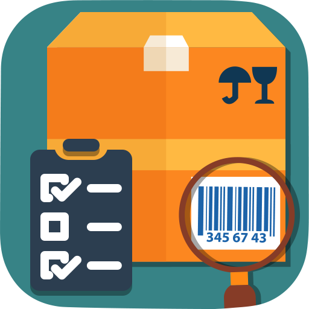

# stock_management

This app is a stock management made with **Flutter**.
The aim is to facilitate the stock management for a store owner.
The owner can add all his products with their information's such as stock quantity, serial number, price.
He can also manage a repository of customers (mainly b2b) and their orders.
The user can generate PDF invoices dynamically if he needs to.

## Technical information

The app uses **Firebase** for the authentication via Google account (aiming to add basic email+password) and for the images' storage.
All the products, customers, invoices information's are stored with **alwaysdata** on a postgres database.

